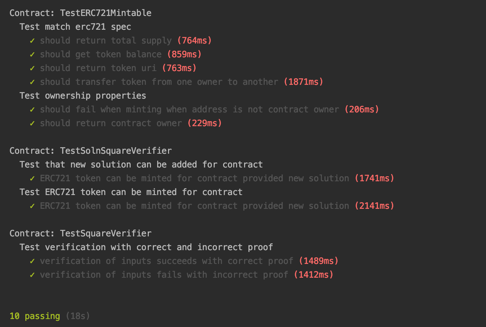
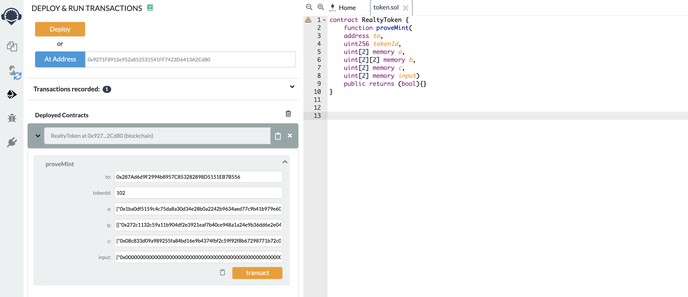
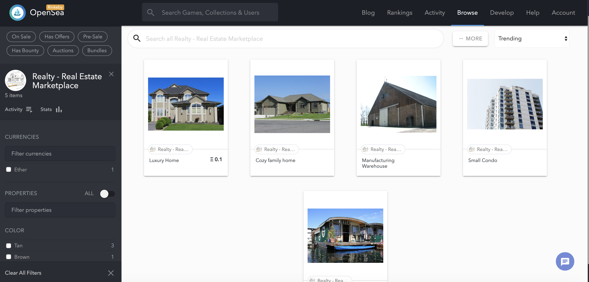
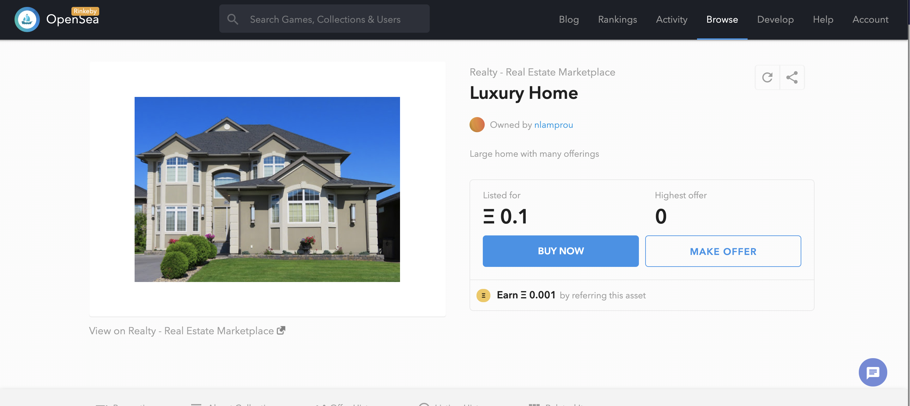
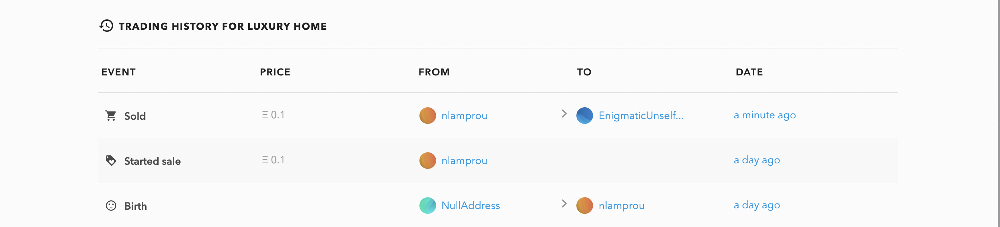

## Real Estate Marketplace on the Blockchain 


This is a demonstration project about representing real estate as a non-fungible tokens and managing them in a decentralised fashion on the Ethereum blockchain. 

The ERC721 standard is used to represent each property as a token. Properties can be minted, assigned metadata that lives off-chain and subsequently traded on an online marketplace.
 
For added security, minting of new properties is only allowed once verification is provided that a property belongs to the owner. 
This is achieved with a zero-knowledge proof, with the owner demonstrating to 3rd parties that they have the title to a property without revealing any information about the property itself. Specifically, the zk-snark methodology is implemented using Zokrates.

Minted tokens are then listed on an online marketplace powered by OpenSea. The storefront can be accessed here: https://rinkeby.opensea.io/assets/realty


## Installation and Setup

This repository contains:
 * Smart Contract code in Solidity (using Truffle), 
 * Tests (also using Truffle), 
 * zk-snarks implementation (using Zokrates)

### Contract Deployment

To deploy contracts, download or clone the repo, then:

`npm install`
`cd eth-contracts && truffle compile`
`cd eth-contracts && truffle migrate`

An infura account is required and the appropriate secret and mnemonic need to be stored appropriately (used in th truffle-config.js)

To deploy to the Rinkeby test network
`cd eth-contracts && truffle migrate --network rinkeby`

```bash
Starting migrations...
======================
> Network name:    'rinkeby'
> Network id:      4
> Block gas limit: 0x989680


2_deploy_contracts.js
=====================

   Deploying 'SquareVerifier'
   --------------------------
   > transaction hash:    0xcff0db28b227bfbc8d6d33bc122db2e67470effd41d305b65e1903d86ea83df4
   > Blocks: 0            Seconds: 4
   > contract address:    0x2198Fc0B6C1287d26E080CBa051c27494422A80c
   > block number:        6109444
   > block timestamp:     1583782996
   > account:             0x287Ad6d9F2994b8957C853282898D5151EB7B556
   > balance:             0.67002068
   > gas used:            992455
   > gas price:           20 gwei
   > value sent:          0 ETH
   > total cost:          0.0198491 ETH


   Replacing 'SquareVerifier'
   --------------------------
   > transaction hash:    0xd175dbd896b62c212fe137c715d72b94ba613135ae175b759688271934b10137
   > Blocks: 0            Seconds: 12
   > contract address:    0x775336637Ef65d106b7e92a8da8a5fBF1E5Bb964
   > block number:        6109445
   > block timestamp:     1583783011
   > account:             0x287Ad6d9F2994b8957C853282898D5151EB7B556
   > balance:             0.65017158
   > gas used:            992455
   > gas price:           20 gwei
   > value sent:          0 ETH
   > total cost:          0.0198491 ETH


   Deploying 'SolnSquareVerifier'
   ------------------------------
   > transaction hash:    0x4220288888e71920a116aa5465c26ed1016a38ac71e300c729688c32306c59af
   > Blocks: 0            Seconds: 8
   > contract address:    0x9271F8912e952a852531541FF7423D6413A2Cd80
   > block number:        6109446
   > block timestamp:     1583783026
   > account:             0x287Ad6d9F2994b8957C853282898D5151EB7B556
   > balance:             0.58411592
   > gas used:            3302783
   > gas price:           20 gwei
   > value sent:          0 ETH
   > total cost:          0.06605566 ETH


   > Saving migration to chain.
   > Saving artifacts
   -------------------------------------
   > Total cost:          0.10575386 ETH


Summary
=======
> Total deployments:   3
> Final cost:          0.10575386 ETH

```

### ZK-SNARKS

ZoKrates is a toolbox for zkSNARKs on Ethereum. The following steps were used to generate zero knowledge proofs and a verifier contract.

* Run ZoKrates docker container (from within zokrates directory):

`
docker run -v $PWD/code:/home/zokrates/code -ti zokrates/zokrates /bin/bash
`

* Compile the program written in ZoKrates DSL

` ~/zokrates compile -i square.code`

* Generate the Trusted Setup. Two keys are generated - 'proving.key' and 'verification.key'

`~/zokrates setup`

* Compute Witness

`~/zokrates compute-witness -a 3 9`

* Generate Proof based on the above 'witness'. A proof.json file is generated in this step

`~/zokrates generate-proof`

* Export Verifier smart contract

`~/zokrates export-verifier`


### Contract Testing

```bash
npm run test
```

 
 
## Minting Tokens

An easy way to mint tokens is to create an interface with the deployed token on Remix, specifying the functions to be used. Once compiled, the contract address of the deployed token can be entered, enabling interaction.
The proveMint function requires the input of a solution created through Zokrates and can only be used once. 

 

## Marketplace

The minted tokens can be listed for sale by creating a storefront on the OpenSea marketplace.

The storefront can be found here: https://rinkeby.opensea.io/assets/realty

 
 
 Properties can be put up for sale
 
 

A full transaction history can be seen under the listed property 

 


## Additional info

Contract Address

```bash
0x9271F8912e952a852531541FF7423D6413A2Cd80
```

Contract ABI

```json
[
    {
      "inputs": [
        {
          "internalType": "address",
          "name": "verifierContractAddress",
          "type": "address"
        }
      ],
      "payable": false,
      "stateMutability": "nonpayable",
      "type": "constructor"
    },
    {
      "anonymous": false,
      "inputs": [
        {
          "indexed": false,
          "internalType": "uint256",
          "name": "solutionIndex",
          "type": "uint256"
        },
        {
          "indexed": false,
          "internalType": "address",
          "name": "solutionProvider",
          "type": "address"
        }
      ],
      "name": "AddedSolution",
      "type": "event"
    },
    {
      "anonymous": false,
      "inputs": [
        {
          "indexed": true,
          "internalType": "address",
          "name": "owner",
          "type": "address"
        },
        {
          "indexed": true,
          "internalType": "address",
          "name": "approved",
          "type": "address"
        },
        {
          "indexed": true,
          "internalType": "uint256",
          "name": "tokenId",
          "type": "uint256"
        }
      ],
      "name": "Approval",
      "type": "event"
    },
    {
      "anonymous": false,
      "inputs": [
        {
          "indexed": true,
          "internalType": "address",
          "name": "owner",
          "type": "address"
        },
        {
          "indexed": true,
          "internalType": "address",
          "name": "operator",
          "type": "address"
        },
        {
          "indexed": false,
          "internalType": "bool",
          "name": "approved",
          "type": "bool"
        }
      ],
      "name": "ApprovalForAll",
      "type": "event"
    },
    {
      "anonymous": false,
      "inputs": [
        {
          "indexed": false,
          "internalType": "address",
          "name": "caller",
          "type": "address"
        }
      ],
      "name": "Paused",
      "type": "event"
    },
    {
      "anonymous": false,
      "inputs": [
        {
          "indexed": true,
          "internalType": "address",
          "name": "from",
          "type": "address"
        },
        {
          "indexed": true,
          "internalType": "address",
          "name": "to",
          "type": "address"
        },
        {
          "indexed": true,
          "internalType": "uint256",
          "name": "tokenId",
          "type": "uint256"
        }
      ],
      "name": "Transfer",
      "type": "event"
    },
    {
      "anonymous": false,
      "inputs": [
        {
          "indexed": false,
          "internalType": "address",
          "name": "caller",
          "type": "address"
        }
      ],
      "name": "Unpaused",
      "type": "event"
    },
    {
      "anonymous": false,
      "inputs": [
        {
          "indexed": false,
          "internalType": "address",
          "name": "_owner",
          "type": "address"
        }
      ],
      "name": "ownerShip",
      "type": "event"
    },
    {
      "constant": false,
      "inputs": [
        {
          "internalType": "bytes32",
          "name": "_myid",
          "type": "bytes32"
        },
        {
          "internalType": "string",
          "name": "_result",
          "type": "string"
        }
      ],
      "name": "__callback",
      "outputs": [],
      "payable": false,
      "stateMutability": "nonpayable",
      "type": "function"
    },
    {
      "constant": false,
      "inputs": [
        {
          "internalType": "bytes32",
          "name": "_myid",
          "type": "bytes32"
        },
        {
          "internalType": "string",
          "name": "_result",
          "type": "string"
        },
        {
          "internalType": "bytes",
          "name": "_proof",
          "type": "bytes"
        }
      ],
      "name": "__callback",
      "outputs": [],
      "payable": false,
      "stateMutability": "nonpayable",
      "type": "function"
    },
    {
      "constant": false,
      "inputs": [
        {
          "internalType": "address",
          "name": "to",
          "type": "address"
        },
        {
          "internalType": "uint256",
          "name": "tokenId",
          "type": "uint256"
        }
      ],
      "name": "approve",
      "outputs": [],
      "payable": false,
      "stateMutability": "nonpayable",
      "type": "function"
    },
    {
      "constant": true,
      "inputs": [
        {
          "internalType": "address",
          "name": "owner",
          "type": "address"
        }
      ],
      "name": "balanceOf",
      "outputs": [
        {
          "internalType": "uint256",
          "name": "",
          "type": "uint256"
        }
      ],
      "payable": false,
      "stateMutability": "view",
      "type": "function"
    },
    {
      "constant": true,
      "inputs": [],
      "name": "baseTokenURI",
      "outputs": [
        {
          "internalType": "string",
          "name": "",
          "type": "string"
        }
      ],
      "payable": false,
      "stateMutability": "view",
      "type": "function"
    },
    {
      "constant": true,
      "inputs": [
        {
          "internalType": "uint256",
          "name": "tokenId",
          "type": "uint256"
        }
      ],
      "name": "getApproved",
      "outputs": [
        {
          "internalType": "address",
          "name": "",
          "type": "address"
        }
      ],
      "payable": false,
      "stateMutability": "view",
      "type": "function"
    },
    {
      "constant": true,
      "inputs": [
        {
          "internalType": "address",
          "name": "owner",
          "type": "address"
        },
        {
          "internalType": "address",
          "name": "operator",
          "type": "address"
        }
      ],
      "name": "isApprovedForAll",
      "outputs": [
        {
          "internalType": "bool",
          "name": "",
          "type": "bool"
        }
      ],
      "payable": false,
      "stateMutability": "view",
      "type": "function"
    },
    {
      "constant": false,
      "inputs": [
        {
          "internalType": "address",
          "name": "to",
          "type": "address"
        },
        {
          "internalType": "uint256",
          "name": "tokenId",
          "type": "uint256"
        }
      ],
      "name": "mint",
      "outputs": [
        {
          "internalType": "bool",
          "name": "",
          "type": "bool"
        }
      ],
      "payable": false,
      "stateMutability": "nonpayable",
      "type": "function"
    },
    {
      "constant": true,
      "inputs": [],
      "name": "name",
      "outputs": [
        {
          "internalType": "string",
          "name": "",
          "type": "string"
        }
      ],
      "payable": false,
      "stateMutability": "view",
      "type": "function"
    },
    {
      "constant": true,
      "inputs": [],
      "name": "owner",
      "outputs": [
        {
          "internalType": "address",
          "name": "",
          "type": "address"
        }
      ],
      "payable": false,
      "stateMutability": "view",
      "type": "function"
    },
    {
      "constant": true,
      "inputs": [
        {
          "internalType": "uint256",
          "name": "tokenId",
          "type": "uint256"
        }
      ],
      "name": "ownerOf",
      "outputs": [
        {
          "internalType": "address",
          "name": "",
          "type": "address"
        }
      ],
      "payable": false,
      "stateMutability": "view",
      "type": "function"
    },
    {
      "constant": false,
      "inputs": [
        {
          "internalType": "address",
          "name": "from",
          "type": "address"
        },
        {
          "internalType": "address",
          "name": "to",
          "type": "address"
        },
        {
          "internalType": "uint256",
          "name": "tokenId",
          "type": "uint256"
        }
      ],
      "name": "safeTransferFrom",
      "outputs": [],
      "payable": false,
      "stateMutability": "nonpayable",
      "type": "function"
    },
    {
      "constant": false,
      "inputs": [
        {
          "internalType": "address",
          "name": "from",
          "type": "address"
        },
        {
          "internalType": "address",
          "name": "to",
          "type": "address"
        },
        {
          "internalType": "uint256",
          "name": "tokenId",
          "type": "uint256"
        },
        {
          "internalType": "bytes",
          "name": "_data",
          "type": "bytes"
        }
      ],
      "name": "safeTransferFrom",
      "outputs": [],
      "payable": false,
      "stateMutability": "nonpayable",
      "type": "function"
    },
    {
      "constant": false,
      "inputs": [
        {
          "internalType": "address",
          "name": "to",
          "type": "address"
        },
        {
          "internalType": "bool",
          "name": "approved",
          "type": "bool"
        }
      ],
      "name": "setApprovalForAll",
      "outputs": [],
      "payable": false,
      "stateMutability": "nonpayable",
      "type": "function"
    },
    {
      "constant": false,
      "inputs": [
        {
          "internalType": "bool",
          "name": "pauseStatus",
          "type": "bool"
        }
      ],
      "name": "setPauseStatus",
      "outputs": [],
      "payable": false,
      "stateMutability": "nonpayable",
      "type": "function"
    },
    {
      "constant": true,
      "inputs": [
        {
          "internalType": "bytes4",
          "name": "interfaceId",
          "type": "bytes4"
        }
      ],
      "name": "supportsInterface",
      "outputs": [
        {
          "internalType": "bool",
          "name": "",
          "type": "bool"
        }
      ],
      "payable": false,
      "stateMutability": "view",
      "type": "function"
    },
    {
      "constant": true,
      "inputs": [],
      "name": "symbol",
      "outputs": [
        {
          "internalType": "string",
          "name": "",
          "type": "string"
        }
      ],
      "payable": false,
      "stateMutability": "view",
      "type": "function"
    },
    {
      "constant": true,
      "inputs": [
        {
          "internalType": "uint256",
          "name": "index",
          "type": "uint256"
        }
      ],
      "name": "tokenByIndex",
      "outputs": [
        {
          "internalType": "uint256",
          "name": "",
          "type": "uint256"
        }
      ],
      "payable": false,
      "stateMutability": "view",
      "type": "function"
    },
    {
      "constant": true,
      "inputs": [
        {
          "internalType": "address",
          "name": "owner",
          "type": "address"
        },
        {
          "internalType": "uint256",
          "name": "index",
          "type": "uint256"
        }
      ],
      "name": "tokenOfOwnerByIndex",
      "outputs": [
        {
          "internalType": "uint256",
          "name": "",
          "type": "uint256"
        }
      ],
      "payable": false,
      "stateMutability": "view",
      "type": "function"
    },
    {
      "constant": true,
      "inputs": [
        {
          "internalType": "uint256",
          "name": "tokenId",
          "type": "uint256"
        }
      ],
      "name": "tokenURI",
      "outputs": [
        {
          "internalType": "string",
          "name": "",
          "type": "string"
        }
      ],
      "payable": false,
      "stateMutability": "view",
      "type": "function"
    },
    {
      "constant": true,
      "inputs": [],
      "name": "totalSupply",
      "outputs": [
        {
          "internalType": "uint256",
          "name": "",
          "type": "uint256"
        }
      ],
      "payable": false,
      "stateMutability": "view",
      "type": "function"
    },
    {
      "constant": false,
      "inputs": [
        {
          "internalType": "address",
          "name": "from",
          "type": "address"
        },
        {
          "internalType": "address",
          "name": "to",
          "type": "address"
        },
        {
          "internalType": "uint256",
          "name": "tokenId",
          "type": "uint256"
        }
      ],
      "name": "transferFrom",
      "outputs": [],
      "payable": false,
      "stateMutability": "nonpayable",
      "type": "function"
    },
    {
      "constant": false,
      "inputs": [
        {
          "internalType": "address",
          "name": "newOwner",
          "type": "address"
        }
      ],
      "name": "transferOwnership",
      "outputs": [],
      "payable": false,
      "stateMutability": "nonpayable",
      "type": "function"
    },
    {
      "constant": false,
      "inputs": [
        {
          "internalType": "address",
          "name": "to",
          "type": "address"
        },
        {
          "internalType": "uint256",
          "name": "tokenId",
          "type": "uint256"
        },
        {
          "internalType": "uint256[2]",
          "name": "a",
          "type": "uint256[2]"
        },
        {
          "internalType": "uint256[2][2]",
          "name": "b",
          "type": "uint256[2][2]"
        },
        {
          "internalType": "uint256[2]",
          "name": "c",
          "type": "uint256[2]"
        },
        {
          "internalType": "uint256[2]",
          "name": "input",
          "type": "uint256[2]"
        }
      ],
      "name": "proveMint",
      "outputs": [
        {
          "internalType": "bool",
          "name": "",
          "type": "bool"
        }
      ],
      "payable": false,
      "stateMutability": "nonpayable",
      "type": "function"
    }
  ]
```

## Project Resources

* [Remix - Solidity IDE](https://remix.ethereum.org/)
* [Visual Studio Code](https://code.visualstudio.com/)
* [Truffle Framework](https://truffleframework.com/)
* [Ganache - One Click Blockchain](https://truffleframework.com/ganache)
* [Open Zeppelin ](https://openzeppelin.org/)
* [Docker](https://docs.docker.com/install/)
* [ZoKrates](https://github.com/Zokrates/ZoKrates)
